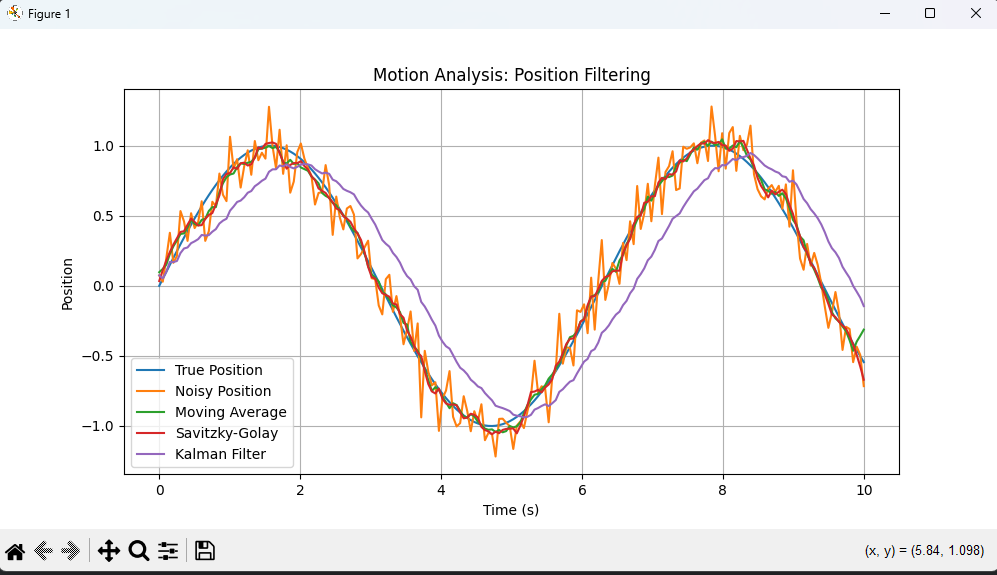
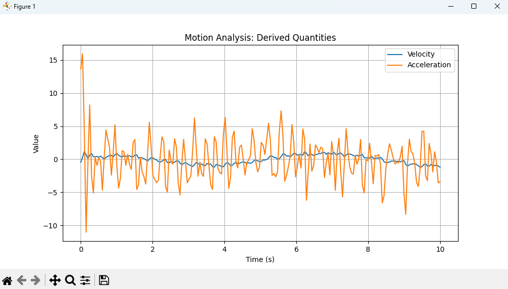

# Motion Analysis and Filtering

This project demonstrates motion smoothing and noise reduction in 1D tracked data using temporal filtering techniques.

Noisy position measurements are processed using multiple filters to obtain smooth motion estimates, followed by computation of velocity and acceleration.

## Concept

Real-world tracking data is often noisy.  
Filters help recover the underlying motion by reducing noise while preserving important trends.

## Methods Used

- Moving Average Filter
- Savitzky-Golay Filter
- Simple 1D Kalman Filter
- Numerical differentiation for velocity and acceleration

## Output

The script visualizes:

- True vs Noisy vs Filtered Position
- Estimated Velocity and Acceleration

## How to Run

pip install -r requirements.txt  
python main.py

## Example Output

### Position Filtering

### Velocity and Acceleration

